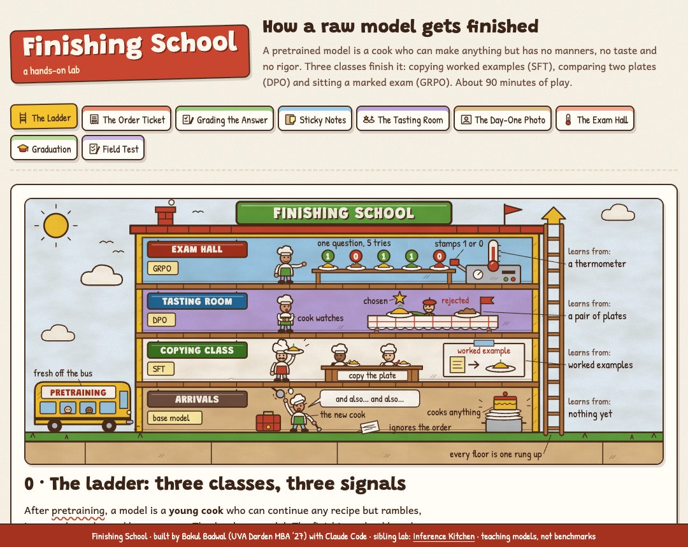
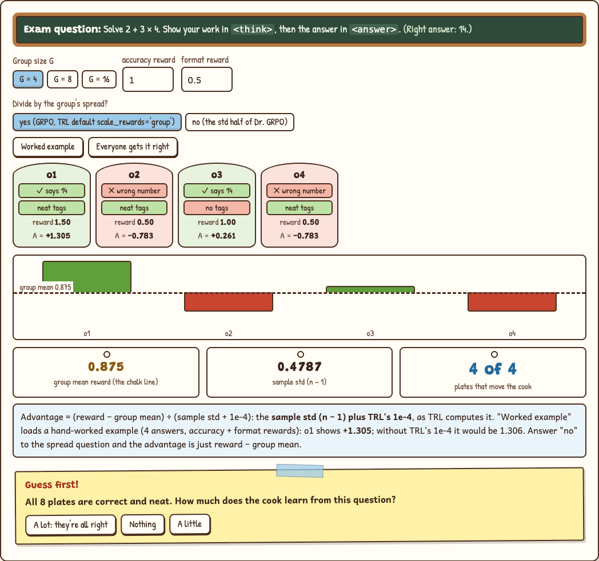

# Finishing School

**A hands-on lab for how a raw language model gets finished.** A pretrained model can cook anything, but it has no manners, no taste and no rigor. Three classes finish it: copying worked examples (**SFT**), comparing two plates (**DPO**) and sitting a marked exam (**GRPO**). Drag the sliders, flip the switches, and watch the exact math move.

**Play it: https://bakulbadwal.github.io/finishing-school/**

The model is a young **cook**. SFT is the **copying class**, the chat template is the **order ticket**, the loss mask is the **red pen that grades only the answer**, LoRA is **sticky notes on the recipe book**, DPO is the **tasting room**, the reference model is **the cook's photo from day one** (β is the length of the leash), and GRPO is the **exam hall**, where a thermometer marks every plate. Hold that picture and the rest follows.

## What's inside

| Step | You play with | What clicks |
|---|---|---|
| **0 · The ladder** | Place three training signals on three classes; one prompt answered by four cooks | Each method learns from a different signal: copying, comparing, or checking. They stack |
| **1 · The order ticket** | A live chat-template render: dialect, `enable_thinking`, `/think` flags, tools | The template is the model's grammar. **On SmolLM3 the system-prompt flag beats the keyword** |
| **2 · Grading the answer** | Per-token probabilities and the completion-only mask | SFT is next-token cross-entropy, and **the mask decides what the model is graded on** |
| **3 · Sticky notes** | Model, LoRA rank, target modules, sequence length, checkpointing; fit on a Mac, a free T4, an RTX 3060, rented GPUs | LoRA trains ~1% of a 2–3B model at rank 16; full fine-tuning costs ~16 bytes per parameter, so **a 3B full fine-tune fits none of them and LoRA fits all** |
| **4 · The tasting room** | The four log-probabilities and β behind one DPO pair; a batch of eight pairs | **DPO's reward is implicit**, its loss starts at **ln 2 = 0.693**, and **higher β is a shorter leash** |
| **5 · The day-one photo** | Reference model, cached log-probs, LoRA, group size, the KL switch | What each method costs per example, and why LoRA makes the reference model free |
| **6 · The exam hall** | A group of plates, a verifier's rewards, the clip ε, the KL leash, and dividing by the group's spread (or not, as Dr. GRPO argues) | **The group is the critic.** A group that all scores the same teaches nothing; dividing by the group's spread can make a trivial gap push as hard as a real one |
| **★ Graduation** | Three client briefs (a bank's help desk, an agency's headline polisher, a SQL answer bot), graded on method, data, memory and budget | You can make the call, and say why the wrong one fails |
| **✓ Field test** | Eight questions you answer by operating the widgets | Proof it stuck |

Each step has predict-then-reveal questions and a "say it out loud" line that unlocks once you've played. Every term has a tooltip with its plain meaning and its school equivalent.

## Why it exists

Most material on post-training is either papers and library docs, or a paragraph of analogy. The best interactive tool, Georgia Tech's [UNIPO](https://poloclub.github.io/unipo/), goes deep on GRPO-family training dynamics from real runs. It doesn't cover the rest of the ladder. This lab covers the whole path from base model to reasoner in one place:
- chat templates, loss masking, LoRA and memory fit
- DPO and GRPO
- the operator's question: **which method, on what data, on which machine, and what breaks it**

Where popular course material and the source paper disagree (the direction of DPO's β), the page says so and follows the paper.

## Run it

Play it live at the link above, or open `index.html` in a browser. There's no build step, no dependencies, and nothing to install.

## What's exact and what's a teaching model

- **Exact:**
  - cross-entropy on the probabilities shown
  - parameter and LoRA counts from each model's Hugging Face `config.json`
  - the 16-bytes-per-parameter accounting
  - the DPO loss, implicit reward, margin and sigmoid
  - GRPO advantages (sample std plus TRL's 1e-4) and the clipped surrogate term
  - forward and backward pass counts
- **Teaching models:**
  - token probabilities are toy numbers
  - activation memory is a rough allowance
  - step 4's "training step" animation is illustrative
  - quoted time and cost figures are quotes
- **The formulas are real; the example numbers are chosen to teach, not measured.**

[`ACCEPTANCE.md`](ACCEPTANCE.md) lists every number the build was checked against. For example: LoRA r = 16 on Qwen3-1.7B trains 17,432,576 parameters, and a hand-worked GRPO example (four answers, accuracy + format rewards) reproduces to three decimals.

## Sources

- Hugging Face, [*a smol course*](https://huggingface.co/learn/smol-course), Units 1–2 (instruction tuning, preference alignment)
- Hugging Face, [*LLM Course*](https://huggingface.co/learn/llm-course), chapter 11 (fine-tuning) and chapter 12 (reasoning models, GRPO)
- Nathan Lambert, [*RLHF Book*](https://rlhfbook.com): ch. 4, 6, 7, 8, 15
- Rafailov et al., "Direct Preference Optimization" (2023) · Shao et al., "DeepSeekMath" (2024, GRPO) · Liu et al., "Understanding R1-Zero-Like Training" (2025, Dr. GRPO) · Hu et al., "LoRA" (2021)
- The SmolLM3-3B model card, and the TRL documentation (`GRPOConfig` defaults)

## Files

| File | Role |
|---|---|
| `index.html` | All teaching copy and page structure |
| `js/core.js` | The math: pure functions, exposed as `window.FS` |
| `js/app.js` | Wires controls to the math and draws the widgets |
| `js/glossary.js` | Tooltip definitions |
| `js/art/*.js` | The eight hand-built SVG cutaway scenes, inlined so they use the page's fonts |
| `PRODUCT.md`, `DESIGN.md`, `ACCEPTANCE.md` | Product brief, the design system (shared with Inference Kitchen), and the checks |

The sequel to [Inference Kitchen](https://github.com/bakulbadwal/inference-kitchen), which teaches how a trained model gets **served**. Built by [Bakul Badwal](https://github.com/bakulbadwal) (UVA Darden MBA '27) with Claude Code.

## License

MIT
